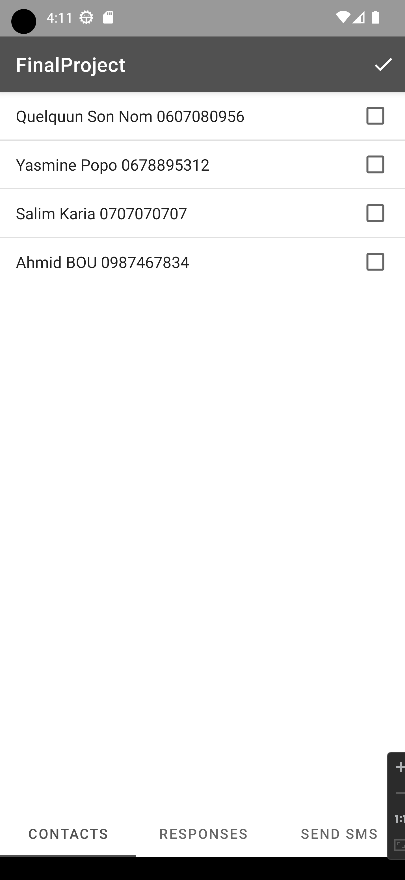
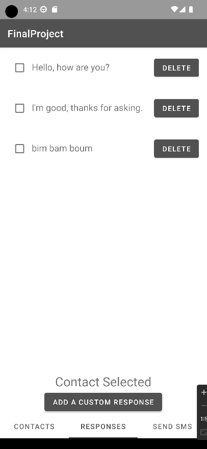

# Android Final Project

Android Studio app in java using fragments 

1st fragment : List of contact with phone number

2nd fragment : List of auto responses with the posibility to add his own (data saved in savePreferences)

3th fragment : coming...

 

 