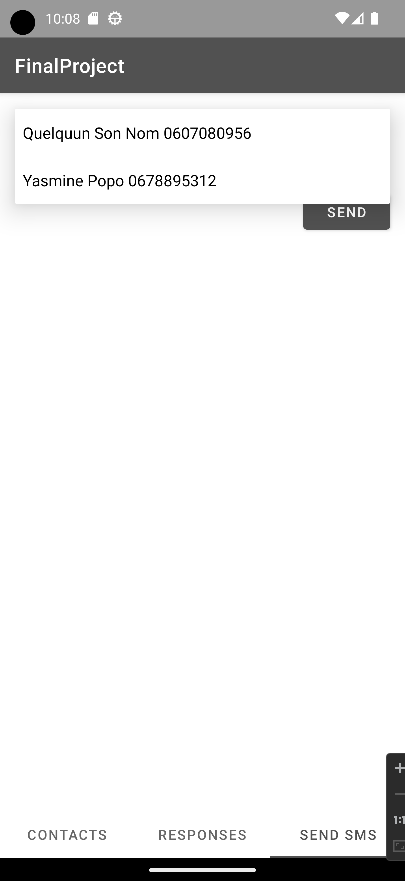

# Android Final Project

#### Android Studio app in java using fragments 

*1st fragment :* List of contact with phone number

*2nd fragment :* List of auto responses with the posibility to add his own (data saved in savePreferences)

*3th fragment :* Retrieve the selected contact/responses in a spinner and send the response to the contact selected

    